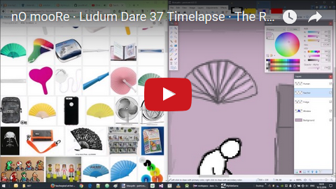
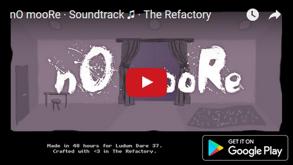
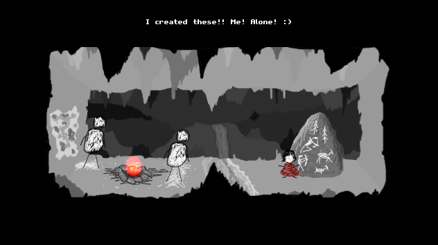
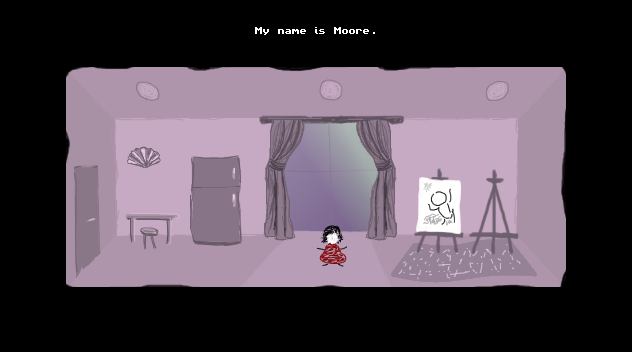

# nO mooRe  

*One Room that doesn't change, but time does... Made in 48h for Ludum Dare 37.*

A short game about a girl who is not allowed to follow her dreams. Her name is Moore and her passion is drawing. She is in One Room that does not change, but time does..

nO mooRe has been crafted in only 48 hours for the Ludum Dare 37 game development competition. <a href="http://ludumdare.com/compo/ludum-dare-37/?action=top&cat=Mood">It has been ranked on the 8th place (out of more than 900 other games) in category "Mood".</a>

You can follow me on my <a href="https://goo.gl/U0x1Fy">development blog</a> for the latest news on this and other projects of mine.

## Download

App now available on Google Play Store.

Download the <a href="dist/nO%20mooRe.zip?raw=true">Java Version for Windows/Linux/OSX</a>.

Play the <a href="http://therefactory.bplaced.net/data/nomoore">web version</a>.

## Timelapse Video

Watch me crafting the game in this timelapse video. 

## Soundtrack

Listen to or download the full soundtrack that I have composed by myself for this game. 

## Screenshots

## Gameplay

Try to find items in the rooms and put them to new positions. There are a total of 3 cutscenes to unlock in the game.

**Tip**: Sometimes, items that can be interacted with are subtly highlighted.

## Bugs, Problems, Feedback?

The more you tell me, the better my apps get. Please use the comments on <a href="https://goo.gl/Lza6Z7">Google Play Store</a> or visit <a href="http://goo.gl/KvKHze">my website</a> to post feedback. 

## Permissions

Your privacy is really important to me. Therefore does this app not require any permissions at all.

## License

Copyright &copy; 2016 Christian DeTamble

Licensed under the GNU General Public License, Version 3.0. See [LICENSE](LICENSE) for details.

    https://www.gnu.org/licenses/gpl-3.0.txt

Game Idea, Sprites, Backgrounds and Music by The Refactory

***

Crafted with &hearts; in <a href="http://goo.gl/KvKHze">The Refactory</a> in Ebensee 2016.

(My software is and stays open source, free of charge and ad-free)
